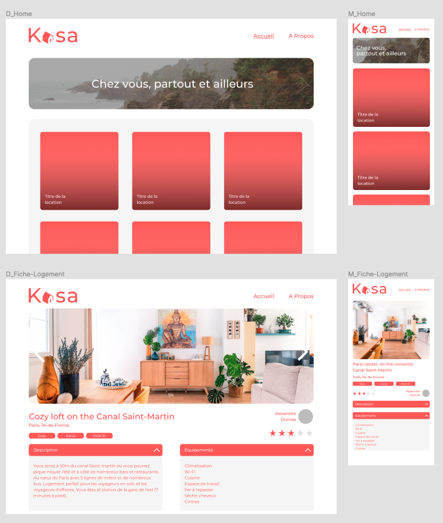
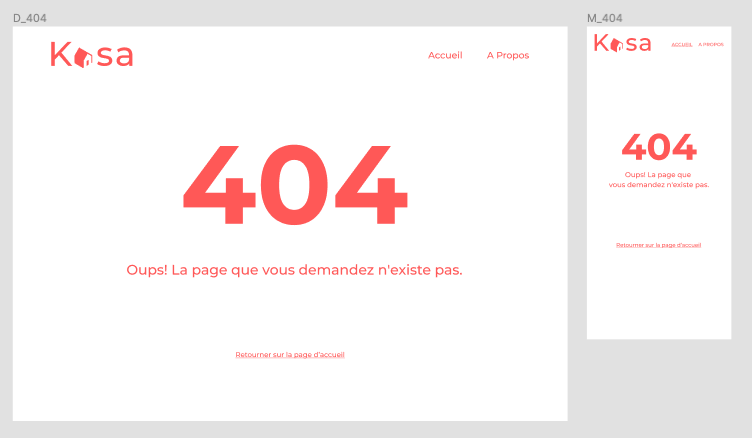
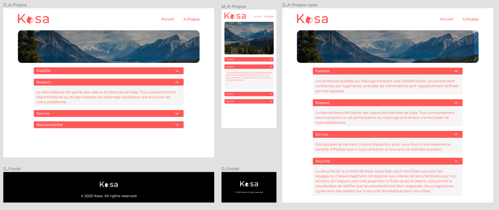

# Project 11 OpenClassrooms - Develop a web application with React and React Router

Développer une nouvelle plate-forme Web pour une entreprise appelée Kasa, spécialisée dans la location d'appartements depuis près de 10 ans maintenant.
Avec plus de 500 annonces déposées chaque jour, Kasa est l'un des leaders de la location d'appartements en France.

## Logo

## Project goal

- Démarrer le projet React et développer l'intégralité de l'application, les composants React, les routes React Router, en suivant les mockups (responsive !).
- Back-end / data : Utilisez les 20 listings de logements du fichier JSON pour construire le Front-end correspondant.

## Technical constraints

#### React

Il est indispensable d'utiliser ces éléments de React pour un code de qualité :

- Décomposition en composants réutilisables à base de modules.
- Un composant par fichier.
- Structure logique des différents fichiers.
- Utilisation d'accessoires entre les composants.
- Utilisation de l'état dans les composants si nécessaire.
- Gestion des événements.
- Listes : React vous permet de faire des choses vraiment intéressantes avec des listes, en itérant dessus, par exemple avec map. Vous devez les utiliser autant que possible.
- Il est également recommandé, mais pas obligatoire, d'utiliser des composants fonctionnels plutôt que des composants de classe.

#### React Router

- Les paramètres de route sont gérés par React Router dans l'URL pour récupérer des informations pour chaque logement.
- Il y a une page par itinéraire.
- La page 404 est retournée pour chaque route inexistante, ou si une valeur présente dans l'URL ne fait pas partie des données saisies.
- La logique du routeur est regroupée dans un seul fichier.

## Functional constraints

- Pour les photos de la galerie (composant Galerie) : Si l'utilisateur est à la première image et clique sur « image précédente », la galerie affiche la dernière image.
- A l'inverse, lorsque l'image affichée est la dernière de la galerie, si l'utilisateur clique sur "image suivante", la galerie affiche la première image.
- S'il n'y a qu'une seule image, les boutons "suivant" et "précédent" n'apparaissent pas.
- La galerie doit toujours rester à la même hauteur qu'indiqué sur la maquette. Les images seront donc réduites et centrées dans le champ image.
- Collapse : Par défaut, les replis sont fermés lors de l'initialisation de la page.
- Si le Collapse est ouvert, le clic de l'utilisateur permet de le fermer.
- A l'inverse, si le Collapse est fermé, l'utilisateur peut cliquer pour l'ouvrir.

## Mockup

Pour lancer le projet il faut installer les modules via Node.js à la racine : 

"npm install"

et

"npm install react-router-dom"

En suite, vous pouvez lancer le projet avec cette commande : 

"npm start"

Si vous rencontrez un problème avec les components SCSS vous pouvez installer ces modules en complément : 

"npm install node-sass"

"npm install sass-loader"

"npm install style-loader css-loader" 

